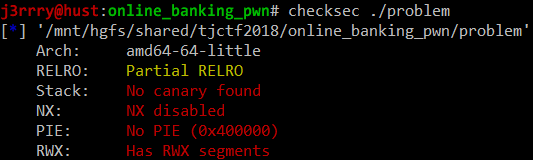
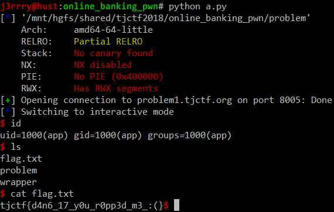

`#asm`, `#bof`, `#shellcode`
# Online Banking
90 points Binary Exploitation - Unsolved (100 solves)  
> Written by nthistle  
>  
> Try out our new online banking service!  
>  
> nc problem1.tjctf.org 8005  
>  
> [Binary](https://static.tjctf.org/b227d63762bf31ccd91aba57d50ab405d5dbe252a43b39acc9d86b6e2fdf74e3_problem) [Source](https://static.tjctf.org/c78eed9e241b2e36eacd5f86a715cbde06ee4c51c66603734dea7fc2e9c32669_problem.c)  
  
## 취약점 발견
```
     7	int verify_pin(char* pin) {
     8	    char pin_check[PIN_SIZE+1];
     9	    printf("Please verify your PIN first:\nPIN: ");
    10	    fgets(pin_check, NAME_SIZE+1, stdin);
    11	    for(int i = 0; i < 4; i ++) {
    12	        if(pin[i] != pin_check[i])
    13	            return 0;
    14	    }
    15	    return 1;
    16	}
```
BOF 취약점이 `verify_pin()`에 있었습니다.  
지역변수 `pin_check`의 크기는 5 이지만  
`fgets`로 33 만큼 받기 때문에 RIP 컨트롤이 가능합니다.  
  
  
보안 세팅이 되어있지 않은 바이너리는  
보통 쉘코드를 메모리에 박는 시나리오를 사용합니다.  
  
## 시나리오
전역변수 `name`에 쉘코드를 삽입하고  
`verify_pin()`에서 BOF를 통해 리턴주소를  
미리 삽입해 놓은 쉘코드의 주소로 덮어쓰는 시나리오입니다.  
  
  
