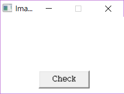
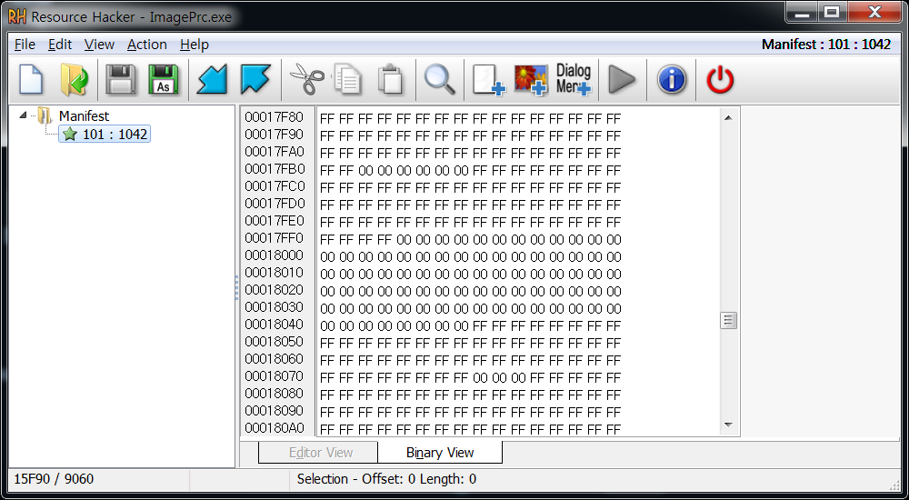

# ImagePrc
## 목차
1. [분석](#분석)  
2. [Flag](#flag)  

## 분석
  
프로그램을 실행시키면 그림을 그릴 수 있는 윈도우가 나타납니다.
```
    24    hWnd = CreateWindowExA(
    25             0,
    26             lpWindowName,
    27             lpWindowName,
    28             0xCA0000u,
    29             pWidth / 2 - 100,
    30             pHeight,
    31             200,
    32             150,
    33             NULL,
    34             NULL,
    35             hInstance,
    36             NULL);
```
가로 200, 세로 150  
  
```
    84        while ( *v13 == v13[v14] )
    85        {
    86          ++i;
    87          ++v13;
    88          if ( i >= 90000 )
    89          {
    90            sub_401500(v8);
    91            return 0;
    92          }
    93        }
    94        MessageBoxA(hWnd, Text, Caption, 0x30u);	// "Wrong"
```
`MessageBox("Wrong")` 이 나오지 않으려면 90000개의 바이트와 같아야한다.  
  
FindResource, LoadResource, LockResource 를 통해 리소스가 사용되었다고 간주하고 까보니까  
  
바로 나왔다.  
  
Bitmap 관련 API 가 사용되었고  
그림판으로 단색, 16bit, 24bit, 256bit 의 비트맵파일을 만들 수 있었는데  
가로 200, 세로 150에 픽셀 데이터 90000 bytes 는 24bit bitmap 이다.  
  
## Flag
  
`GOT`
