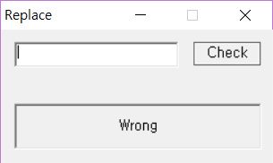
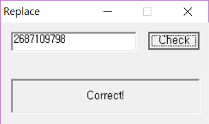

# Replace
## 목차
1. [일단 실행해보자](#일단-실행해보자)
2. [문자열 검색부터 시작하는 의식의 흐름](#문자열-검색부터-시작하는-의식의-흐름)
3. [dword_4084D0 중심으로 분석](#dword_4084d0-중심으로-분석)
4. [someOffset(=dword_4084D0) 정리하고 공격지점 확인](#someoffset-정리하고-공격지점-확인)
5. [끝](#끝)
### 일단 실행해보자
  
메시지 박스가 나오고  
입력은 10진수 숫자만 가능했다.  
  
"Wrong" 이라는 문자열이 있었는데  
이 문자열을 "Correct!" 로 바꿀 수 있는 숫자를 넣어야한다.  
  
만약 입력한 숫자가 틀리면  
잠시후 종료된다.  
  
### 문자열 검색부터-시작하는-의식의-흐름
```
.data:00406034 00000009 C Correct!
```
문자열 검색을 해보니  
"Correct!" 문자열은 .data 영역 0x406034 에 있다.  
  
```
.data:00406034 ; CHAR String[]
.data:00406034 String          db 'Correct!',0         ; DATA XREF: DialogFunc+53o
```
XREF 를 따라가보면  
  
```
.text:00401050                 push    0               ; bSigned
.text:00401052                 push    0               ; lpTranslated
.text:00401054                 push    3EAh            ; nIDDlgItem
.text:00401059                 push    esi             ; hDlg
.text:0040105A                 call    ds:GetDlgItemInt
.text:00401060                 mov     dword_4084D0, eax
.text:00401065                 call    sub_40466F
.text:0040106A                 xor     eax, eax
.text:0040106C                 jmp     loc_404690
.text:00401071 ; ---------------------------------------------------------------------------
.text:00401071
.text:00401071 loc_401071:                             ; CODE XREF: DialogFunc+36A4j
.text:00401071                 jmp     short loc_401084
.text:00401073 ; ---------------------------------------------------------------------------
.text:00401073                 push    offset String   ; "Correct!"
.text:00401078                 push    3E9h            ; nIDDlgItem
.text:0040107D                 push    esi             ; hDlg
.text:0040107E                 call    ds:SetDlgItemTextA
```
`GetDlgItemInt` 함수는  
메시지 박스에 우리가 입력한 정수를 받는다.  
  
이 부분부터 BP 걸고 순서대로 동적 디버깅을 하는데  
`dword_4084D0` 을 주목한다.  
### dword_4084D0 중심으로 분석
```
.text:00404690 loc_404690:                             ; CODE XREF: DialogFunc+4Cj
.text:00404690 mov     eax, dword_4084D0
.text:00404695 push    offset loc_40469F
.text:0040469A call    sub_404689
.text:0040469F
.text:0040469F loc_40469F:                             ; DATA XREF: DialogFunc+3675o
.text:0040469F mov     dword ptr ds:loc_40466F, 0C39000C6h
.text:004046A9 call    loc_40466F
      ↓
.text:0040466F loc_40466F:                             ; CODE XREF: DialogFunc+45p
.text:0040466F                                         ; DialogFunc+3689p ...
.text:0040466F mov     byte ptr [eax], 90h
.text:00404672 retn
```
0x40466F 에서 참조 에러가뜨면서 프로그램이 종료된다. (CRASH)  
0x404690 로 거슬러 올라가보면 eax 는 `dword_4084D0` 이었습니다.  
( 0x40466F == loc_40466F 는 `replace` 로 rename )  
  
이번엔 dword_4084D0 을 `someOffset` 이라고 rename 하고  
BP 걸고 집중적으로 따라가봅니다.  
```
.text:0040105A call    ds:GetDlgItemInt
.text:00401060 mov     someOffset, eax

someOffset = GetDlgItemInt()
```
`GetDlgItemInt` 에서 데이터를 처음 초기화해주고  
  
```
.text:00404684                 call    $+5
.text:00404689
.text:00404689 sub_404689      proc near               ; CODE XREF: DialogFunc+367Ap
.text:00404689                 inc     someOffset
.text:0040468F                 retn

someOffset++
someOffset++
```
+1 +1 해주고  
  
```
.text:00404674 add     someOffset, 601605C7h

someOffset += 0x601605C7
```
+0x601605C7 해주고  
  
```
.text:00404684                 call    $+5
.text:00404689
.text:00404689 sub_404689      proc near               ; CODE XREF: DialogFunc+367Ap
.text:00404689                 inc     someOffset
.text:0040468F                 retn

someOffset++
someOffset++
```
한번더 +1 +1 해주고  
  
```
.text:0040466F mov     byte ptr [eax], 90h
.text:00404672 retn
```
결국엔 참조 에러가 떠서 종료가 된다.  
  
### someOffset 정리하고 공격지점 확인
`someOffset` 을 정리해보면  
```
someOffset = GetDlgItemInt()+1+1+0x601605C7+1+1
```
우리가 입력하는 정수값에 따라서  
데이터를 덮어쓸 수 있겠다는 것을 알았다.  
특히 0x90 은 instruction opcode 로 NOP 에 해당한다.  
  
혹시나해서 .text 영역을 보니  
```
.text 00401000 00405000 R W X . L para 0001 public CODE 32 0000 0000 0003 FFFFFFFF FFFFFFFF
```
어랏 쓰기 권한이 열려있네  
  
그럼 어디를 고쳐써야 할까?  
  
지금까지 분석했던 곳의 아래로 좀더 분석을 해보자.  
```
.text:0040469F mov     dword ptr ds:replace, 0C39000C6h
.text:004046A9 call    replace
.text:004046AE inc     eax
.text:004046AF call    replace
.text:004046B4 mov     dword ptr ds:replace, 6E8h
.text:004046BE pop     eax
.text:004046BF mov     eax, 0FFFFFFFFh
.text:004046C4 jmp     loc_401071
    ↓
.text:00401071 jmp     short loc_401084
.text:00401073 ; ---------------------------------------------------------------------------
.text:00401073 push    offset String                   ; "Correct!"
.text:00401078 push    3E9h                            ; nIDDlgItem
.text:0040107D push    esi                             ; hDlg
.text:0040107E call    ds:SetDlgItemTextA
```
`replace` 루틴( `someOffset` 에 NOP 으로 덮기 )을 다 하고  
jmp 를 하는 곳을 보면  
"Correct!" 부분 근처이다.  
  
0x401071 의 jmp 를 NOP 으로 바꾼다면 성공이다.  
  
### 끝
```
someOffset = GetDlgItemInt()+1+1+0x601605C7+1+1
```
`someOffset` 이 0x401071 이 되려면  
```
GetDlgItemInt() = someOffset-(1+1+0x601605C7+1+1)
                =  0x401071 -(1+1+0x601605C7+1+1)
                = -1607857498

                = 0x100000000 - 1607857498
                = 2687109798
```
입력할 값은 2687109798 이 된다.  
  
  
"Correct!" 가 뜬다.
